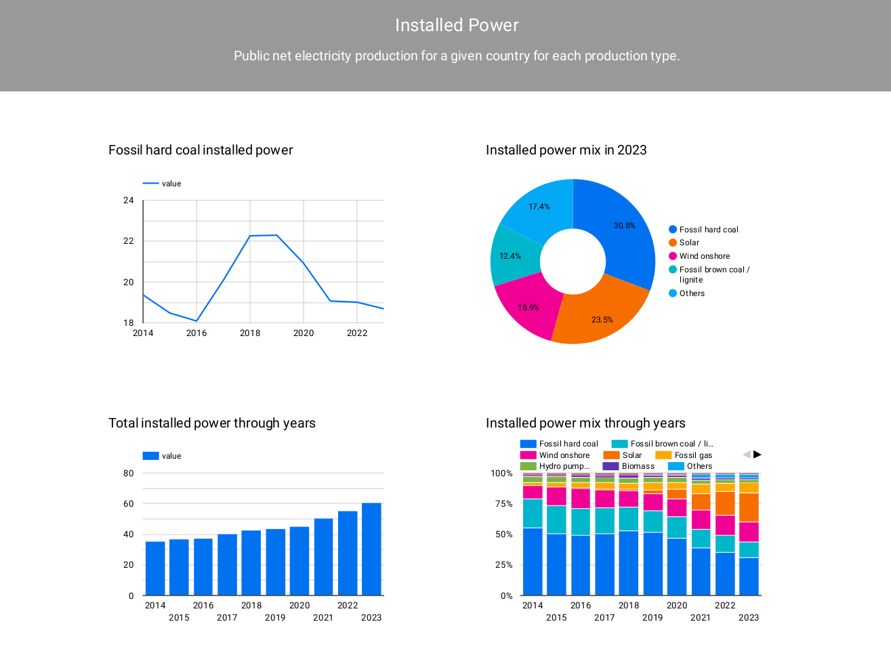
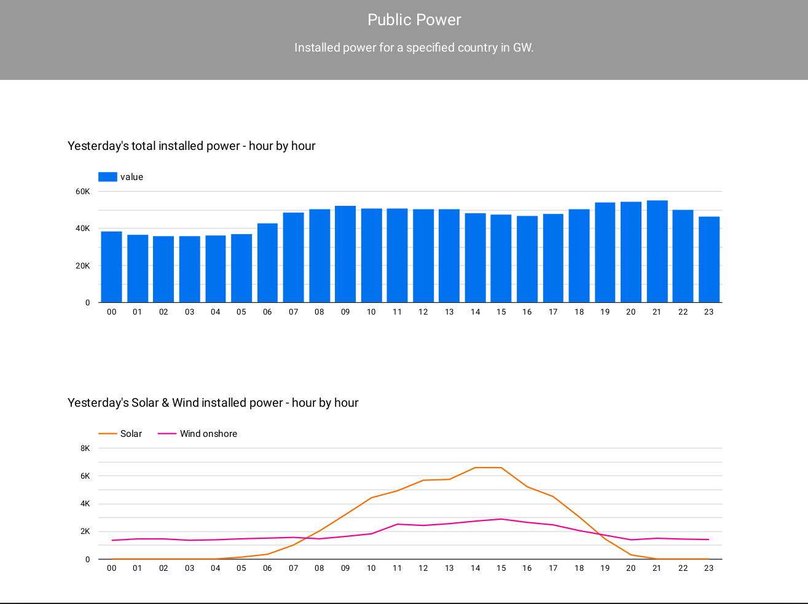
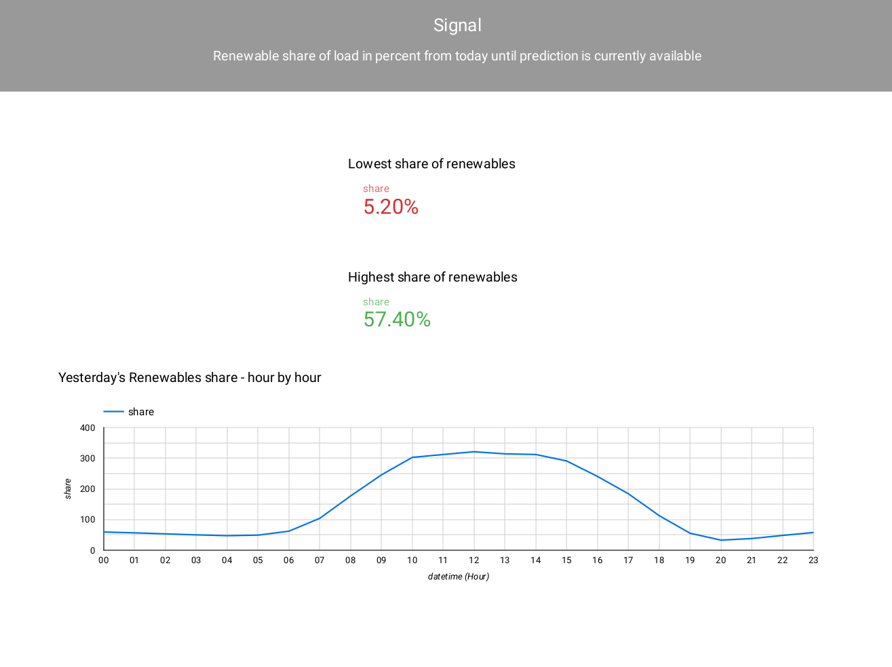
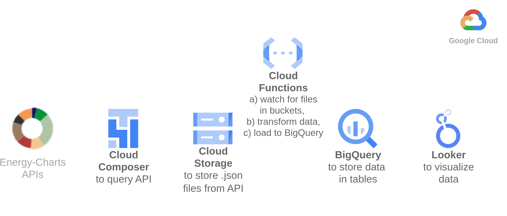
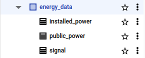

## 0. Introduction
This is a dummy project. It uses GCP (Google Cloud Platform) resources with Python to build an ETL pipeline.

## 1. Project Overview
- Project Name: Energy Data in Poland.
- Project Description: This project creates an ETL pipeline & creates a daily report to track the market of energy in Poland.

## 2. About
### Data Sources
All sources come from [Energy-Charts API](https://api.energy-charts.info/#/).
| **API name**     | **Request URL**                                                                                            | **Data interval** |
|------------------|------------------------------------------------------------------------------------------------------------|-------------------|
| /public_power    | https://api.energy-charts.info/public_power?country=pl                                                     | Hourly            |
| /installed_power | https://api.energy-charts.info/installed_power?country=pl&time_step=yearly&installation_decommission=false | Yearly            |
| /signal          | https://api.energy-charts.info/signal?country=pl                                                           | Hourly            |

### Requirements
I received the following requirements from Energy Company:
#### General
1. End goal is to visualize the data in a report (i.e. Looker Studio)
2. We want to have this data available in tabular format also (i.e. BigQuery)
3. System must keep the "raw" files in Google Cloud Storage buckets. (for regulatory and tracking purposes)
4. Logic must be in place to prevent duplicate loading. (i.e. inserting "Solar, 999, 2023" twice)
5. We want the data to be refreshed with this frequency:
   
| **API name**     | **Frequency**      |
|------------------|--------------------|
| /public_power    | daily at 7AM CET   |
| /installed_power | daily at 7AM CET   |
| /signal          | Every 1-Jan at 6AM |

### Target Systems
1. Cloud Storage (for raw files)
2. BigQuery database (for data in tables)

## 3. Architecture
### High-level Architecture

### BigQuery database schema

(for data types, etc., see the [schema_and_queries.sql](bigquery/schema_and_queries.sql) file)
### Tech Stack
#### Core Technologies
* **Programming Language:** Python 3
* **Cloud Platform:** Google Cloud Platform (GCP)

#### Data Engineering Tools
* **Orchestration:** Cloud Composer (Airflow)
* **Data Pipeline:** Cloud Functions
* **Data Storage:** Google Cloud Storage (GCS)
* **Data Processing:** BigQuery
* **Data Visualization:** Looker Studio

## 4. Step-by-Step Guide
### Prerequisites:
- **Google Cloud Platform:** free trial account is sufficient

### Configuration:
1. **Cloud Composer:** create your instance & load files from *dags* folder there
2. **Cloud Storage:** Create 3 buckets for each API type (public_power, installed_power, signal)
3.  create dataset & all tables (queries available in [schema_and_queries.sql](bigquery/schema_and_queries.sql) file)
4. **Cloud Function:** Create 3 functions for each API type (public_power, installed_power, signal). Files in *cloud_functions* folder
5. **Looker:** source the data from BigQuery & make your own report

### Execution:
Your DAGs will run as per their interval. Rest of the flow will happen automatically.